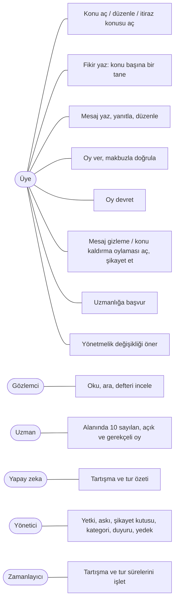
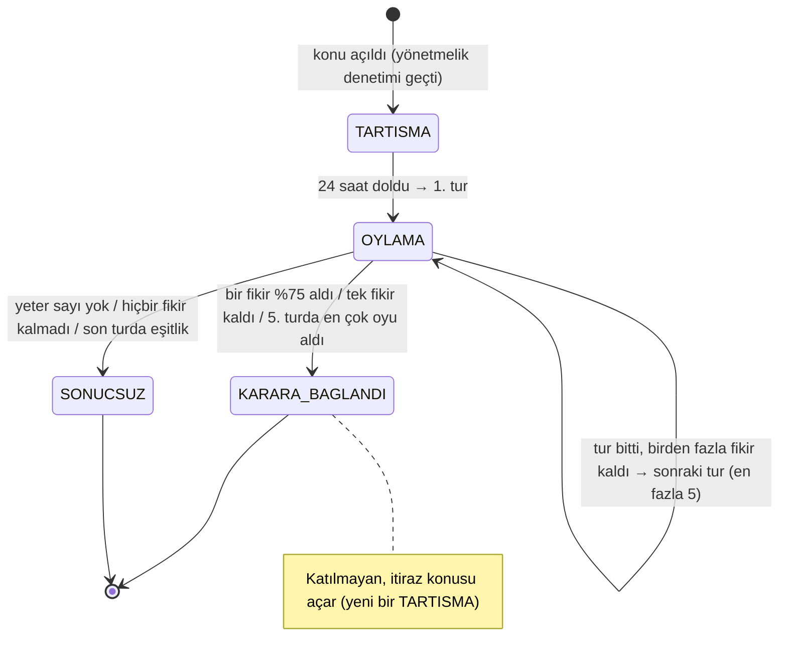
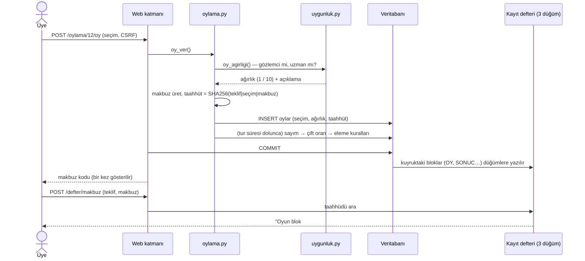
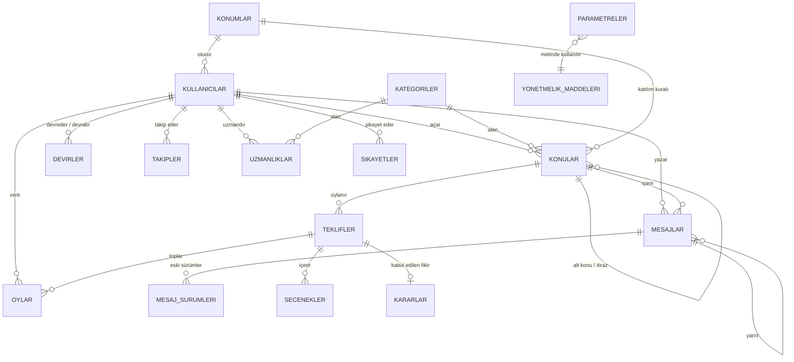
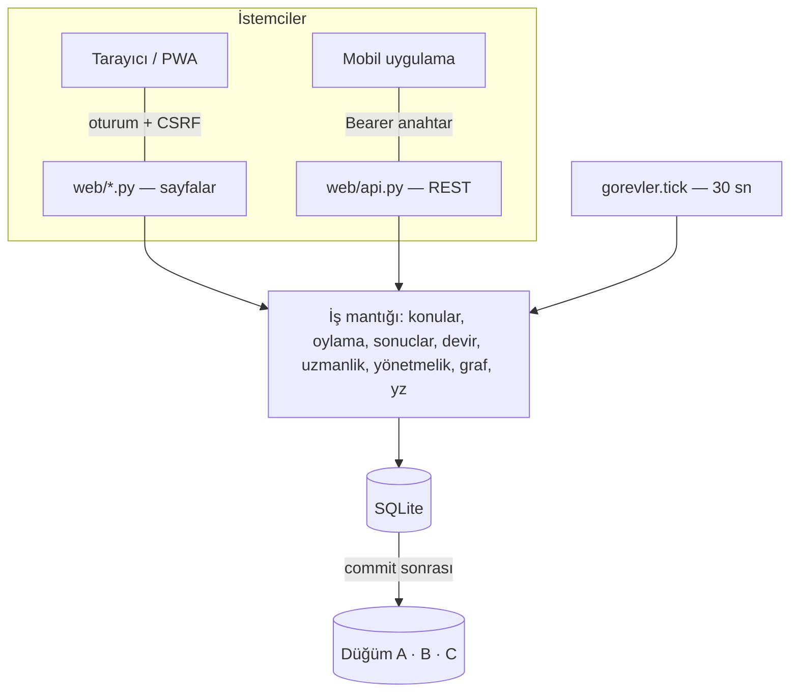

# Agora — Tasarım Belgesi

Bu belgedeki diyagramlar Mermaid ile yazılmıştır (GitHub'da ve VS Code'da Mermaid eklentisiyle çizilir).

## 1. Kullanım durumu (use case)

## 2. Konunun yaşam döngüsü (durum diyagramı)

Eleme eşikleri: 1. tur %5, 2. tur %5, 3. tur %10, 4. tur %20. Oran = ağırlıklı pay ile kişi payının küçüğü.

## 3. Oy verme ve sonuçlandırma (sıralı diyagram)

## 4. Varlık–ilişki (veri modeli)

## 5. Katmanlar

## 6. Görsel tasarım: "Sade akış" ve iki renk

**Bilgi mimarisi:** Eski kenar menüsündeki 9 bölüm, 6 kategori ve 2 alt bağlantı üç ana bölümde toplandı.

| Bölüm | İçinde |
|---|---|
| Konular | Konu akışı, kategori çipleri, durum filtresi (açılır menü), bekleyen oylar şeridi, arama |
| Oylamalar | Gündem (süren oylamalar), kararlar arşivi |
| Meclis | Nasıl işler?, yönetmelik, kayıt defteri, üye ağı, şeffaflık günlüğü, API, yönetim (yalnızca yönetici) |
| Avatar menüsü | Panelim, bildirimler, herkese açık profil, yönetim paneli (yöneticilere), çıkış |
| Panelim (`/profil`) | Solda bölüm menüsü: özet, bildirimler, hesap bilgileri, oy devri, uzmanlık, güvenlik, uygulama ve API |
| Yönetim paneli (`/yonetim`) | Solda bölüm menüsü: pano, üyeler, konular, oylamalar, kategoriler, sistem, günlük; kullanıcı sayfalarında yönetici düğmesi yok |
| Telefon / mobil uygulama | Üst çubukta logo, arama, bildirim ve avatar; ana bölümler alttaki sekme çubuğunda (ortada yeni konu düğmesi) |

**Giriş katmanı:** `/` adresi ziyaretçiye tanıtım sayfasını (tapınak çizimi, canlı sayılar, bir konunun 4 adımda karara
dönüşmesi, şu an mecliste olan konular, üyelik çağrısı) gösterir; giriş yapmış üye aynı adreste doğrudan konu akışını görür.
Konu akışı `/konular` adresindedir. Giriş, üye ol ve şifre sıfırlama sayfaları solda kaktüs yeşili bir tanıtım paneli,
sağda form olan iki sütunlu bir kabuk kullanır (`giris_kabugu` makrosu).

Konu sayfasının sağ sütunu da beş kutudan üçe indi (senin durumun + oy ağırlıkları, işlemler, bu konudaki oylamalar ve alt konular).

| Renk | Nerede |
|---|---|
| Taş beyazı `#ebe7df`, kartlarda `#f6f4ef` (ana renk) | Sayfa zemini, üst çubuk, kartlar, mesajlar, formlar |
| Kaktüs yeşili `#4a6642` ve tonları (yan renk) | Düğmeler, seçili sekme ve çip, rozetler, gündem şeridi, aşama noktaları, bağlantılar |

- Taş beyazı, güneş almış mermer tonunun (`#f6e9d9`) biraz silikleştirilip grileştirilmiş hâlidir. Yazılar koyu gridir
  (`#2c2a27`); başka renk yoktur.
- Kırmızı olmadığı için durumlar ikon ve dolgu biçimiyle ayrılır (oylamada = açık yeşil + nokta, sonuçlandı = koyu yeşil + ✓,
  olumsuz = kesikli çerçeve + ✕). Konu kartındaki yedi nokta (tartışma, beş tur, karar), konunun hangi aşamada olduğunu gösterir.
- Emojiler işletim sistemine göre renkli çizildiği için tek renkli çizgi ikonlarla (`web/ikonlar.py`) değiştirildi.
- Logo: kaktüs yeşili zemin üzerinde, yivli Dor sütunlu taş beyazı bir meclis binası.

## 7. Temel kararlar ve gerekçeleri

| Karar | Gerekçe |
|---|---|
| Konu hemen açılır, kabul oylaması yok | Herkesin derdini anlatabilmesi; çoğunluk konunun açılmasına değil sonucuna karar verir. |
| Kişi başı tek fikir | Herkes eşit söz alır; kimse onlarca seçenekle oylamayı boğamaz. |
| Tur tur eleme (%5, %5, %10, %20) | Çok sayıda fikir adım adım azalır; her turda oylar kalan fikirlerde yeniden toplanır. |
| Ezici üstünlük (%75) ve "tek kalan" kısa yolları | Belli olmuş bir sonucu beş tur beklemeye gerek yok. |
| Oran = ağırlıklı pay ile kişi payının küçüğü | Uzman ağırlığı kalabalığı tek başına yenemez; kalabalık da uzmanları yok sayamaz. |
| Çekimser paydada sayılır | Nötr oy da çoğunluğun sağlanıp sağlanmadığını etkiler. |
| Her oylama tek bir "teklif" mekanizmasından geçer | Fikir turları, gizleme, kaldırma, uzmanlık ve yönetmelik aynı sayım kurallarını paylaşır; kod tekrarı olmaz. |
| Uzmanlık: ön şart + kontenjan + alanın oylaması | Uzmanlık emekle ve alanın onayıyla kazanılır; kontenjan, bir kliğin birbirini uzman yapmasını önler. |
| Yönetici yalnızca yönetir | Karar yetkisi yalnızca oylamalardadır; yönetim panelinde kararı etkileyen işlem tanımlı değildir. |
| Şikayet tabanı (3 üye) | Tek kişinin şikayeti yöneticiyi meşgul etmez; taban dolunca da kararı yine oylama verir. |
| Eşikler veritabanında | Topluluk kendi kurallarını oylayabilir. Korunan maddeler 3/4 ister (anayasa gibi). |
| Defter yalnızca commit sonrası yazılır | Geri alınan işlemler deftere girmez; veritabanı ve defter tutarlı kalır. |
| Deftere kişisel veri yazılmaz | Mesajların özeti, oyların taahhüdü yazılır; gizli oy ve KVKK korunur. |
| Yapay zeka yalnızca özetler | Kararlar üyelere aittir; yapay zeka oy kullanmaz, özetleri sayılara dayanır. |
