# Agora — Tasarım Belgesi

Bu belgedeki diyagramlar Mermaid ile yazılmıştır (GitHub'da ve VS Code'da Mermaid eklentisiyle çizilir).
Problem çerçeveleme, metrikler, ölçümler ve işlevsel olmayan gereksinimler [analiz.md](analiz.md) dosyasındadır.
SOLID ilkeleri ve tasarım desenlerinin projedeki karşılıkları 8. bölümde.

## 1. Kullanım durumu (use case)

## 2. Konunun yaşam döngüsü (durum diyagramı)

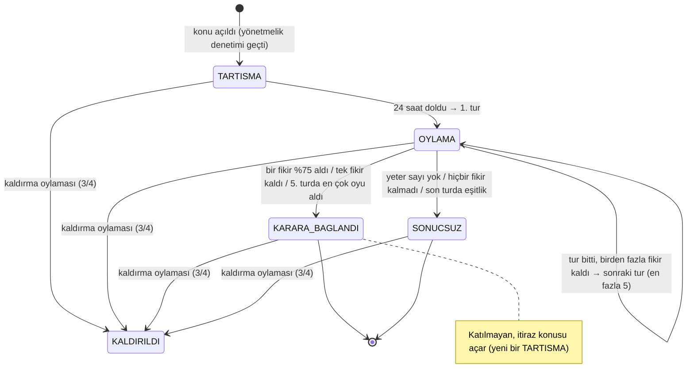

Eleme eşikleri: 1. tur %5, 2. tur %5, 3. tur %10, 4. tur %20. Oran = ağırlıklı pay ile kişi payının küçüğü.
Durumlar kodda **State** desenidir (`forum/konu_durumlari.py`, 8.2): her durum "bu durumda ne yapılabilir?" sorusunu kendisi
yanıtlar ve izin verilen geçişleri bilir. KALDIRILDI ayrı bir sütun değil, `silindi = 1` bayrağıdır; kaldırılan konunun içeriği
ve geçmişi gösterilmez.

## 3. Oy verme ve sonuçlandırma (sıralı diyagramlar)

**Oy verme.** Yazan her istek baştan yazma kilidini alır (`BEGIN IMMEDIATE`); oy, ancak tur hâlâ açıksa yazılır. Defter, veritabanının
"işlem kaydedildi" olayına abonedir (Observer): veritabanı defteri tanımaz.

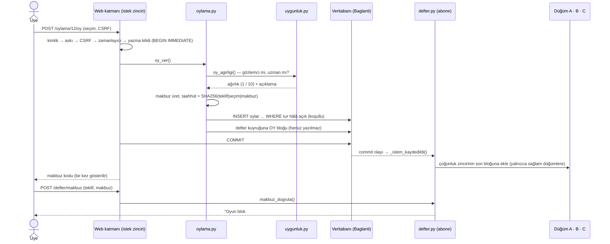

**Tur sonu.** Zamanlayıcı (her 30 sn ve her istekte) süresi dolan turları sonuçlandırır. Her oylama ayrı bir kayıt noktasında
(SAVEPOINT, Memento) işlenir: biri hata verirse yalnızca o geri alınır, diğerleri sürer. Sonuçlandırma bir Template Method'dur;
türe özgü adımlar Strategy nesnesinden (teklif türü) gelir.

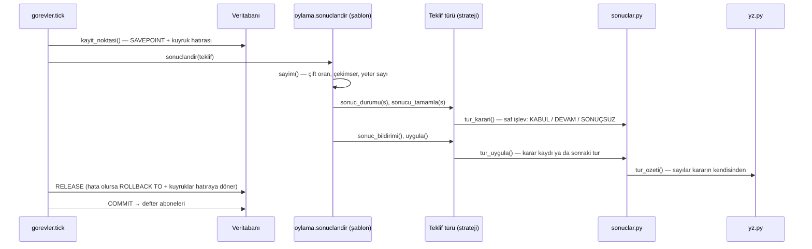

## 4. Varlık–ilişki (veri modeli)

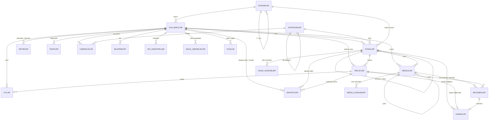

Yabancı anahtarı olmayan tablolar: `giris_denemeleri` (hız sınırı ve giriş kilidi; anahtar = takma ad ya da adres), `site_ayarlari`
(duyuru, yeni üyelik açık mı, kategori ağacının sürümü), `arama` (tam metin arama dizini, FTS), `parametreler` ve
`yonetmelik_maddeleri` (aralarındaki bağ yalnızca mantıksaldır: madde metnindeki `{KOD}` yer tutucuları parametrenin güncel değeriyle doldurulur). Kayıt defteri düğümleri (A.db, B.db, C.db)
veritabanının dışında, ayrı dosyalardadır.

## 5. Katmanlar

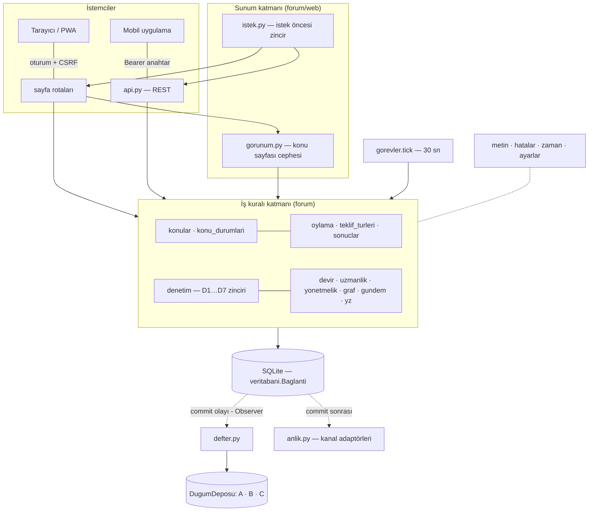

Kesikli oklar: altyapı katmanı (veritabanı) üst katmanı **çağırmaz**; olay yayımlar, üst katman abone olur (DIP).

## 6. Görsel tasarım: "Sade akış" ve iki renk

**Bilgi mimarisi:** Eski kenar menüsündeki 9 bölüm, 6 kategori ve 2 alt bağlantı üç ana bölümde toplandı.

| Bölüm | İçinde |
|---|---|
| Konular | Konu akışı, kategori çipleri, durum filtresi (açılır menü), bekleyen oylar şeridi, arama |
| Oylamalar | Gündem (süren oylamalar), kararlar arşivi |
| Meclis | Nasıl işler?, yönetmelik, kayıt defteri, üye ağı, şeffaflık günlüğü, API |
| Avatar menüsü | Panelim, bildirimler, herkese açık profil, yönetim paneli (yöneticilere), çıkış |
| Panelim (`/profil`) | Solda bölüm menüsü: özet, bildirimler, hesap bilgileri, oy devri, uzmanlık, güvenlik, uygulama ve API |
| Yönetim paneli (`/yonetim`) | Solda bölüm menüsü: pano, üyeler, şikayetler, konular, oylamalar, toplu bildirim, kategoriler, sistem, günlük; kullanıcı sayfalarında yönetici düğmesi yok |
| Telefon / mobil uygulama | Üst çubukta logo, arama, bildirim ve avatar; ana bölümler alttaki sekme çubuğunda (ortada yeni konu düğmesi) |

**Giriş katmanı:** `/` adresi ziyaretçiye tanıtım sayfasını (tapınak çizimi, canlı sayılar, bir konunun 4 adımda karara
dönüşmesi, şu an mecliste olan konular, üyelik çağrısı) gösterir; giriş yapmış üye aynı adreste doğrudan konu akışını görür.
Konu akışı `/konular` adresindedir. Giriş, üye ol ve şifre sıfırlama sayfaları solda kaktüs yeşili bir tanıtım paneli,
sağda form olan iki sütunlu bir kabuk kullanır (`giris_kabugu` makrosu).

Konu sayfasının sağ sütunu beş kutu yerine üçe indirildi: üyenin durumu ve oy ağırlıkları, işlemler, bu konudaki oylamalar ve alt konular.

| Renk | Nerede |
|---|---|
| Taş beyazı `#ebe7df`, kartlarda `#f6f4ef` (ana renk) | Sayfa zemini, üst çubuk, kartlar, mesajlar, formlar |
| Kaktüs yeşili `#4a6642` ve tonları (yan renk) | Düğmeler, seçili sekme ve çip, rozetler, gündem şeridi, aşama noktaları, bağlantılar |

- Taş beyazı, güneş almış mermer tonunun (`#f6e9d9`) biraz silikleştirilip grileştirilmiş hâlidir. Yazılar koyu gridir
  (`#2c2a27`); başka renk yoktur.
- Kırmızı olmadığı için durumlar ikon ve dolgu biçimiyle ayrılır (oylamada = açık yeşil + nokta, sonuçlandı = koyu yeşil + ✓,
  olumsuz = kesikli çerçeve + ✕). Konu kartındaki yedi nokta (tartışma, beş tur, karar), konunun hangi aşamada olduğunu gösterir.
- Emojiler işletim sistemine göre renkli çizildiği için tek renkli çizgi ikonlar kullanıldı (`web/ikonlar.py`).
- Logo: kaktüs yeşili zemin üzerinde, yivli Dor sütunlu taş beyazı bir meclis binası.

## 7. Temel kararlar ve gerekçeleri

| Karar | Gerekçe |
|---|---|
| Konu hemen açılır, kabul oylaması yok | Herkesin derdini anlatabilmesi; çoğunluk konunun açılmasına değil sonucuna karar verir. |
| Kişi başı tek fikir | Herkes eşit söz alır; kimse onlarca seçenekle oylamayı boğamaz. |
| Tur tur eleme (%5, %5, %10, %20) | Çok sayıda fikir adım adım azalır; her turda oylar kalan fikirlerde yeniden toplanır. |
| Ezici üstünlük (%75) ve "tek kalan" kısa yolları | Belli olmuş bir sonucu beş tur beklemeye gerek yok. |
| Oran = ağırlıklı pay ile kişi payının küçüğü | Uzman ağırlığı kalabalığı tek başına yenemez; kalabalık da uzmanları yok sayamaz. |
| Çekimser paydada sayılır | Nötr oy da çoğunluğun sağlanıp sağlanmadığını etkiler. |
| Her oylama tek bir "teklif" mekanizmasından geçer | Fikir turları, gizleme, kaldırma, uzmanlık, yönetmelik ve yeni kategori aynı sayım kurallarını paylaşır; kod tekrarı olmaz. |
| Uzmanlık: ön şart + kontenjan + alanın oylaması | Uzmanlık emekle ve alanın onayıyla kazanılır; kontenjan, bir kliğin birbirini uzman yapmasını önler. |
| Yönetici yalnızca yönetir | Karar yetkisi yalnızca oylamalardadır; normal çalışmada yönetim panelinde kararı etkileyen işlem tanımlı değildir. Tek istisna sunum kipindeki (`--demo`) "Süreyi ilerlet": beklemeyi kısaltır, sayım kurallarını değiştirmez, günlüğe yazılır. |
| Şikayet tabanı (3 üye) | Tek kişinin şikayeti yöneticiyi meşgul etmez; taban dolunca da kararı yine oylama verir. |
| Eşikler veritabanında | Topluluk kendi kurallarını oylayabilir. Korunan maddeler 3/4 ister (anayasa gibi). |
| Defter yalnızca commit sonrası yazılır | Geri alınan işlemler deftere girmez; veritabanı ve defter tutarlı kalır. |
| Deftere kişisel veri yazılmaz | Mesajların özeti, oyların taahhüdü yazılır; gizli oy ve KVKK korunur. |
| Yapay zeka yalnızca özetler | Kararlar üyelere aittir; yapay zeka oy kullanmaz, özetleri sayılara dayanır. |

## 8. Tasarım ilkeleri (SOLID) ve tasarım desenleri

Atıflar *Yazılım Tasarım Desenleri* slaytlarına (TD-numara). Bir desen ancak kodda somut bir sorunu çözdüğü yerde kullanıldı
(TD-3: "desen bir amaç değil, araçtır"; TD-57: YAGNI ve KISS). 8.2'deki her GoF deseninin "önce" sütunu, desenin hangi sorunu
çözdüğünü gösterir ve davranışı testle korunur (test sınıfı adları; aksi yazılmadıkça `testler/test_duzeltmeler.py` içinde).
GoF'un tam biçimi olmayan, Python'un dil özellikleriyle yapılan hafif karşılıklar ayrı tabloda (8.2 sonu) ve öyle adlandırıldı.

### 8.1 SOLID (TD-9…12)

| İlke | Önce (ihlal) | Şimdi | Nerede |
|---|---|---|---|
| **S** — Tek sorumluluk | `web/__init__.kur()` 150 satırda kimlik, CSRF, zamanlayıcı, hata sayfaları ve şablon filtrelerini birlikte yapıyordu. Yönetmelik modülü hem maddeleri hem denetim motorunu taşıyordu. Konu sayfası rotası iş kuralı içeriyordu. | Her biri kendi modülünde | `web/istek.py`, `web/hata_sayfalari.py`, `web/sablon.py`, `denetim.py`, `gorunum.py`, `metin.py`, `hatalar.py` |
| **O** — Açık/kapalı | Yeni oylama türü 5 dosyada `if tip == …` dalı demekti; yeni bildirim kanalı `if tur == 'WEB'` dalı | Yeni tür = yeni sınıf + `@kaydet` + `ayarlar.TEKLIF_TIPLERI`'nde bir yapılandırma satırı; yeni denetim maddesi = yeni halka; yeni kanal = yeni adaptör; yeni depo = yeni `DugumDeposu` | `teklif_turleri.py`, `denetim.py`, `anlik.py`, `defter.py` |
| **L** — Liskov | Web Push kanalı, `pywebpush` kurulu değilken abone kabul edip her bildirimde hata veriyordu (alt tür sözleşmeyi bozuyordu) | Kapalı kanal abone kabul etmez. Bütün teklif türleri şablon yöntemde aynı biçimde kullanılır. SQLite ve bellek depoları aynı sonucu ve aynı hatayı verir (yinelenen blokta önceden biri `ValueError`, öteki `sqlite3.IntegrityError` veriyordu; şimdi ikisi de `YinelenenBlok`) | `test_forum.py: test_kapali_kanala_abone_olunmaz_ve_gonderilmez`, `TeklifTurleri`, `DefterOlceklenmesi.test_sorgu_islemleri_iki_depoda_ayni`, `DepoSozlesmesi` |
| **I** — Arayüz ayrımı | — | Küçük arayüzler: `AnlikKanal` 3 yöntem, `DenetimKurali` 1 soyut yöntem (`kontrol`), `DugumDeposu` 5 soyut yöntem (sorgular varsayılanlı). **İstisna:** `TeklifTuru` 18 yöntemli geniş bir arayüz (4 soyut, 14 varsayılanlı kanca); `FikirTuru` bazı kancaları anlamsız değerlerle dolduruyor. Bölmek için ikinci bir tüketici yok, bilerek bırakıldı (8.7) | `anlik.py`, `denetim.py`, `defter.py`, `teklif_turleri.py` |
| **D** — Bağımlılığın tersine çevrilmesi | Veritabanı bağlantısı (altyapı) defter modülünü (üst katman) içe aktarıyordu. Şifre özeti yöntemi sabitti; zaman `datetime.now()` ile her yerden okunuyordu | Veritabanı defteri tanımaz: defter commit olayına abone olur (Observer). İş modülleri bağlantıyı (`db`) ve defter işlevleri depo kaynağını parametre olarak alır. Şifre yöntemi, saat ve bildirim kanalları birer **test dikişidir** (seam): modül düzeyindeki değişken testte değiştirilir; gerçek bir bağımlılık enjeksiyonu değildir (8.6) | `veritabani.commit_aboneligi`, `defter._depolar`, `guvenlik.SIFRE_YONTEMI`, `zaman.simdi`, `anlik.KANALLAR` |

### 8.2 Uygulanan desenler

| Desen | Önceki sorun | Agora'da | Test |
|---|---|---|---|
| **State** (TD-43) | `konu["durum"] == …` karşılaştırmaları modüllere, web katmanına ve şablonlara dağılmıştı; unutulan bir kontrol kaldırılmış konunun geçmişini okunur bırakıyordu | `konu_durumlari.py`: `KonuDurumu` + 5 durum sınıfı; izinler (`yazilabilir`, `okunabilir`, `zamanli`, `fikir_yazilabilir`…) ve geçiş tablosu (`sonrakiler`). Geçişi yapan üç işlem tabloya danışır: `durum_degistir` ve `konuyu_kaldir` `gecis_dogrula` ile; `oylamayi_baslat` atomik UPDATE'in koşulunu `onceki_durumlar("OYLAMA")` ile tablodan kurar. Şablonlardaki izin kontrolleri de durum nesnesinden okunur. **Bilinçli sapma (TD-48):** geçişi durum nesnesi kendisi yapmaz; geçiş veritabanı, defter ve bildirim yazımı gerektirir, bunları durum sınıflarına taşımak döngüsel bağımlılık doğururdu. Şablonlarda kalan `konu.durum == …` karşılaştırmaları yalnızca rozet ve metin gösterimidir | `KonuDurumMakinesi`, `GizliIcerikSizmaz` |
| **Strategy** (TD-36) | Sonuç uygulama kuralları türe göre `if/elif` ve dağınık sözlüklerde | `teklif_turleri.py`: `TeklifTuru` ve 6 somut tür (`FikirTuru`, `MesajGizlemeTuru`, `KonuKaldirmaTuru`, `UzmanlikTuru`, `YonetmelikTuru`, `KategoriTuru`) | `TeklifTurleri` |
| **Template Method** (TD-41) | Her türün sonuçlandırması aynı iskeleti tekrar ediyordu | `oylama.sonuclandir`: sayım → `sonuc_durumu` → `sonucu_tamamla` → `sonuc_bildirimi` → `uygula`; adımlar stratejinin kancaları. TD-41'deki biçim kalıtımlıdır; burada iskelet bir işlevde, kancalar Strategy nesnesinde (kompozisyonla şablon). Kalıtımlı örnek: `DenetimKurali.isle` iskeleti, alt sınıfın `kontrol` kancasını çağırır | `TeklifTurleri`, `DenetimZinciri` |
| **Chain of Responsibility** (TD-44) | D1–D7 tek 77 satırlık fonksiyondaydı; mesaj denetimi D1 ve D2'yi ayrıca yeniden yazıyordu | `denetim.py`: her madde bir halka (`SayginDil` … `Aciklik`); mesajlara uygulananlar `mesajlara_uygulanir`. Web'de `web/istek.py` istek öncesi zinciri (kimlik → askı → CSRF → zamanlayıcı → yazma kilidi) | `DenetimZinciri` |
| **Adapter** (TD-24) | `pywebpush` ve Firebase HTTP v1 farklı arayüzler; çağıran kod iki dalı da biliyordu | `anlik.py`: `AnlikKanal` ← `WebPushKanali`, `FcmKanali`; testlerde `SahteKanal` | `AnlikAbonelikAdresi` |
| **Memento** (TD-47) | Zamanlayıcıda bir konunun hatası bütün işi geri alıyordu; geri alınan bloğun defter/bildirim yan etkileri kuyrukta kalıyordu | `veritabani.KuyrukHatirasi` (hatıra) + `kayit_noktasi()` (SAVEPOINT): bağlantı (Originator) kuyruklarının durumunu hatıraya yazar, hata olursa ondan geri yükler | `ZamanlayiciYalitimi` |
| **Observer** (TD-38) | `Baglanti.commit` defteri doğrudan çağırıyordu | `veritabani.commit_aboneligi`; üretimde tek abone `defter._islem_kaydedildi`. Bağlantı başına `commit_sonrasi` kuyruğu (bildirimler) | `CommitGozlemcisi` |
| **Repository** (TD-51) | Düğüm dosyalarına `sqlite3` erişimi uzlaşma ve onarım mantığına gömülüydü; test için disk gerekiyordu; ölçeklenme düzeltmesi yapılamıyordu | Yalnızca **kayıt defteri düğümleri** için: `defter.DugumDeposu` ← `SqliteDugumDeposu` (üretim), `BellekDugumDeposu` (sahte depo, test). Forum verisinin kendisi Repository arkasında değildir: iş modülleri SQLite'a doğrudan SQL yazar (8.4) | `DefterDeposu`, `DefterOlceklenmesi` |
| **Facade** (TD-28) | Konu sayfası rotası alt sistemleri tek tek çağırıyor, fikir rozeti kuralı rotadaydı | `gorunum.konu_sayfasi()` 7 alt sistemi (konular, oylama, kararlar, uygunluk, devir, kullanicilar, yz) tek çağrıda toplar; kural saf işlev `gorunum.fikir_durumu` | `KonuSayfasiCephesi` |

**Python'un hafif karşılıkları (GoF'un tam biçimi değil).** Aşağıdakiler aynı amaca dilin kendi araçlarıyla ulaşır; GoF
deseni sayılmamalıdır (TD-26: "Python'daki @decorator sözdizimi fonksiyon sarmalamadır; GoF Decorator ise nesne sarmalamadır").

| Ad | Agora'da | Neden tam desen değil |
|---|---|---|
| Kayıt (Registry, TD-49) | `teklif_turleri.TURLER` + `@kaydet`: yinelenen kodu ve ayarlarda olmayan türü reddeder (testli: `TeklifTurleri`) | Tam karşılık. `anlik.KANALLAR` ve `web/sablon.FILTRELER` ise düz sözlüktür |
| Fabrika işlevi (TD-16) | `teklif_turleri.tur(kod)`, `denetim.zincir_kur(*siniflar)`, `defter._depolar(kaynak)` | `tur(kod)` yeni nesne üretmez, kayıttaki tek örneği döndürür; `_depolar` yol verilince her zaman SQLite deposu kurar |
| Fonksiyon dekoratörü | `giris_gerekli`, `yonetici_gerekli` rotayı sarar | Python dekoratörü; `@kaydet` ve `@commit_aboneligi` hiçbir şeyi sarmaz, yalnızca kaydeder |
| Ertelenmiş iş kuyruğu | `commit_sonrasi` ve defter kuyrukları: iş commit'te çalışır, rollback'te silinir (testli: `YanEtkiDayanikliligi`) | Argümansız kapanış (closure) listesi; TD-40'taki `calistir/geri_al` yok. Doğru adı *transactional outbox*'tır (rehber 25.11) |
| Test dikişi (seam) | `guvenlik.SIFRE_YONTEMI` (testte hızlı özet), `zaman.simdi` (testte ileri sarılır), `anlik.KANALLAR` (sahte kanal), `defter._saat` | Modül düzeyindeki değişkenin üzerine yazılır; kurucuya verilen bir bağımlılık değildir. Kazanç: test süresi 94 testte ~60 sn'den 201 testte ~12 sn'ye indi |
| Değer görüntüsü | `sonuclar.TurKarari`: turun kararı saf bir değer nesnesi olarak saklanır; sonradan parametre değişse de geçmiş tur aynı gösterilir (testli: `TurKarariAnlikGoruntusu`) | Geri yükleyen bir Originator yok; Memento değil, değiştirilemez değer nesnesidir |

### 8.3 Sınıf diyagramları

**State — konu durumları**

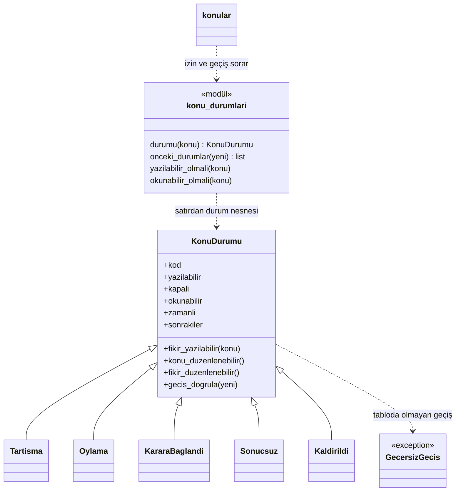

**Strategy + Template Method + Registry — oylama türleri**

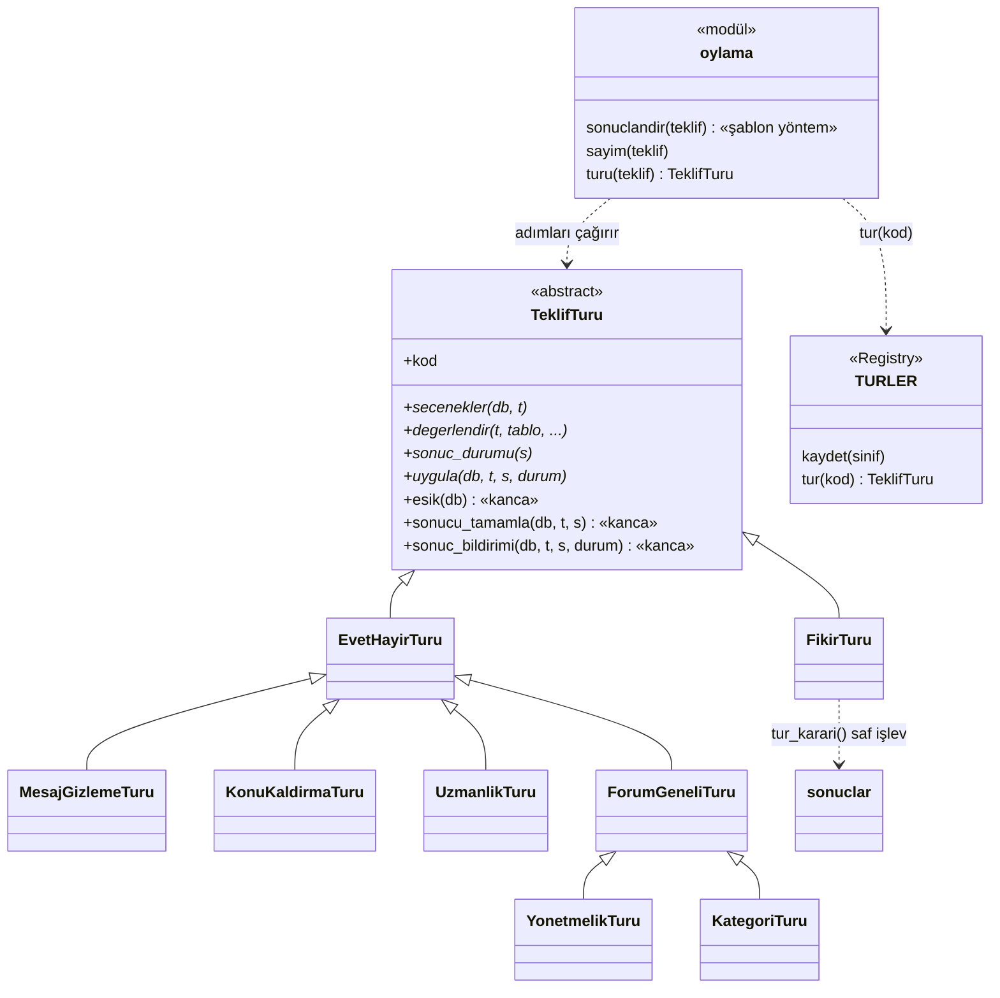

**Chain of Responsibility — yönetmelik denetimi**

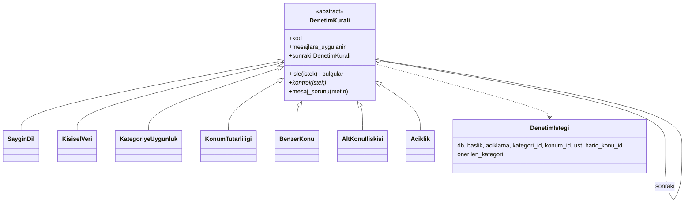

**Adapter — anlık bildirim kanalları**

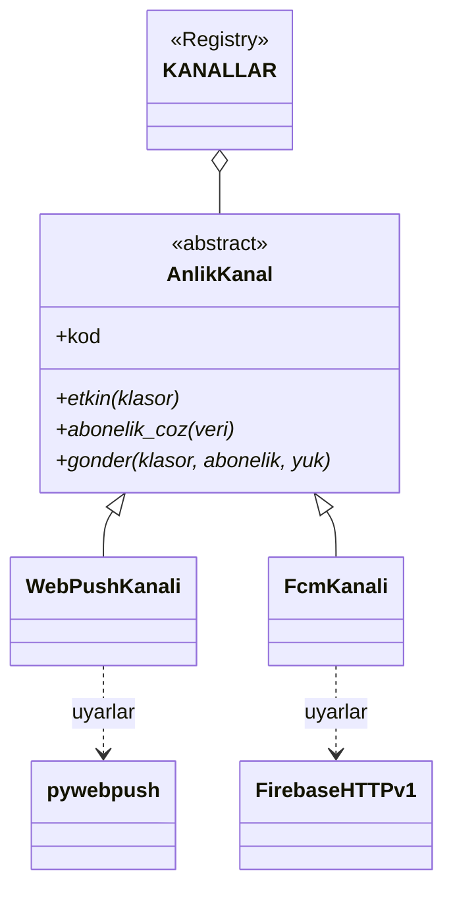

**Repository + Observer — kayıt defteri**

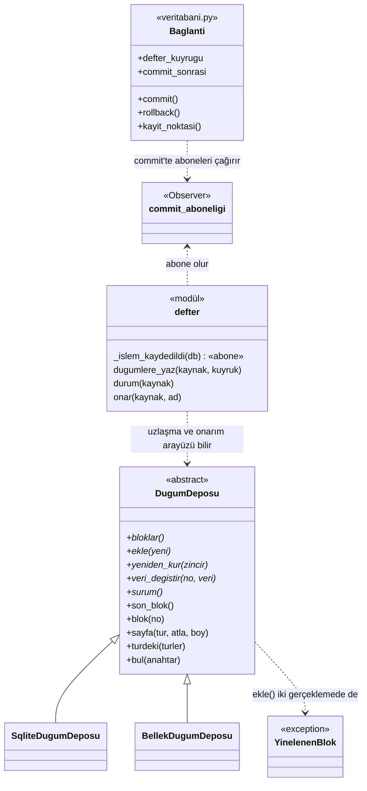

**Facade — konu sayfası**

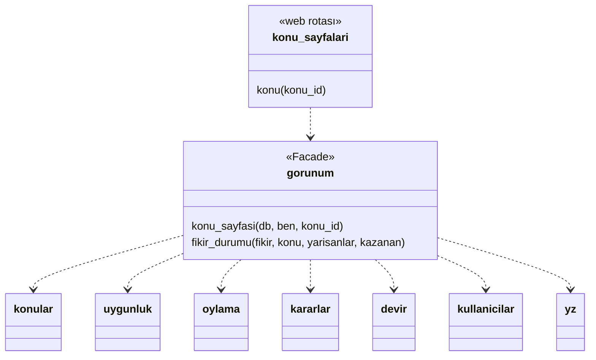

### 8.4 Ödev slaytındaki gereksinimlerin karşılığı (TD-59)

Slayttaki maddeler bir ML sistemi içindir; Agora'da ML modeli yok (analiz.md 3. bölüm). Bu yüzden karşılıklar birebir değil,
en yakın benzerdir; nerede eksik kaldığı da yazıldı.

| Slayttaki madde | Agora'daki en yakın karşılığı | Sınırı |
|---|---|---|
| Seçim yapılandırmadan yapılsın (Registry + Factory) | Oylama türünün adı, eşiği ve süresi `ayarlar.TEKLIF_TIPLERI`'nde; sınıflar `@kaydet` ile kaydolur, `tur(kod)` ile seçilir. Şifre yöntemi ve gizli anahtar ortam değişkeninden | Hangi türün çalışacağı yapılandırmadan değil, `teklifler.tip` sütunundaki veriden seçilir (yakın benzer) |
| Ön işleme ve model tek nesnede (Pipeline) | Denetim zinciri `denetim.ZINCIR`: metin bütün halkalardan geçer. Ölçüm betiği (`olcum/denetim_olcumu.py`) üretimdeki aynı kodu çağırır, yani ölçülen ile çalışan aynıdır | Öğrenilmiş bir model ve ön işleme adımı yok |
| Veri kaynağı değiştirilebilsin (Repository) | `DugumDeposu`: defter düğümleri SQLite dosyasında ya da bellekte | Yalnızca defter için. Üretim yolu yol verilince SQLite deposunu kendisi kurar (`defter._depolar`) ve süreçler arası kilit SQLite'a özgüdür; PostgreSQL için bu iki yer de değişir. Forum verisi doğrudan SQLite'tadır |
| Olaylar birden çok bileşene haber versin (Observer) | `commit_aboneligi`: defter commit olayına abone; bağlantı başına `commit_sonrasi` (bildirimler) | Üretimde tek abone var; mekanizma çok aboneliye hazır |
| Tek giriş noktası (Facade) | `gorunum.konu_sayfasi` | — |
| Her bileşen için birim testi (sahte depo ile) | `BellekDugumDeposu` (sahte depo), `SahteKanal` (sahte bildirim kanalı), sahte zaman | Sahte nesneyle birim testi defter, bildirim kanalı ve saat için. İş modüllerinin testleri her testte yeni kurulan geçici bir SQLite veritabanıyla çalışır (entegrasyon testi); 201 test ~12 sn |

### 8.5 Bilerek kullanılmayan desenler (TD-57, TD-58)

| Desen | Neden kullanılmadı |
|---|---|
| Singleton | Python modülü zaten tekildir (`ayarlar`, `KANALLAR`). Ayrı bir Singleton sınıfı TD-57'deki "gizli global durum" anti-desenini getirirdi |
| Builder, Prototype, Abstract Factory | Çok parametreli, adım adım kurulan nesne ya da birden çok altyapı ailesi yok |
| Visitor | Tür hiyerarşisi üzerinde sık eklenen yeni işlem yok; stratejinin kancaları yetiyor |
| Mediator | Bileşenler birbirleriyle karmaşık biçimde konuşmuyor; katmanlı çağrı yeterli |
| Proxy | Tembel yükleme yalnızca `pywebpush` içe aktarımında gerekli; bunun için bir sınıf gereksiz |
| Composite | Kategori ve konum ağaçları veri olarak var ama ağacın düğümlerine ortak bir işlem arayüzü gerekmedi |
| Iterator | Python'da yerleşik (üreteçler: `DenetimKurali.halkalar()`) |

**Modül bağımlılıkları (TD-12, DIP).** İş modülleri arasında karşılıklı çağrı var (ör. `oylama` ↔ `teklif_turleri` ↔
`konular`). Modül düzeyinde bir döngü `import forum.teklif_turleri` ilk içe aktarma olarak yapılınca hata veriyordu; ortak
sabitler ve eşik karşılaştırması yaprak bir modüle (`oy_kurallari.py`) taşınarak kırıldı. Her modülün tek başına yüklenebildiği
testle korunur (`ModulDongusu`). Üç işlev içi içe aktarma (`yonetmelik`, `konular`, `kullanicilar` içinde) çalışma anı
döngülerini bilerek erteler; bunları kaldırmak bir olay yolu (Observer) ya da modülleri yeniden bölmek gerektirir, şimdilik
gerekmedi.

### 8.6 Giderilen anti-desenler (TD-57)

| Anti-desen | Neredeydi | Nasıl giderildi |
|---|---|---|
| God function | `web/__init__.kur()` (150 satır), `yonetmelik.denetle` (77 satır) | 3 modül; 7 halka |
| Uzun `if durum == …` zinciri (TD-58: State) | Konu durumu kontrolleri, sonuç türü dalları, kanal dalları | State, Strategy, Adapter |
| Kopya kod | Güvenli yönlendirme kontrolü 5 kopya (biri açık yönlendirme açığı içeriyordu), yüzde biçimi 4 kopya, mesaj denetimi D1/D2 iki kopya | `metin.site_ici_yol_mu`, `metin.yuzde`, tek zincir |
| Gizli global durum | Sabit şifre yöntemi, her yerde `datetime.now()` | **Azaltıldı, bitmedi.** Zaman tek kaynaktan (`zaman.simdi`), şifre yöntemi ayarlanabilir. Kalan modül düzeyi durum: `veritabani._COMMIT_ABONELERI` (abonelikten çıkma yok), `defter._SQLITE_DEPOLARI` ve `_DOGRULAMA` (önbellek), `defter._saat`; demo verisi yüklenirken `zaman.simdi` süreç genelinde geçici olarak değiştirilir (`ornek_veri.py`). Tek süreçli dağıtımda zararsız; çok kiracılı (aynı süreçte birden çok forum) kullanımda bağlam nesnesine taşınmalı |
| Yapılandırma borcu (doğrulanmamış ayar) | Oylamayla `UZMAN_AGIRLIK=0`, eleme eşiği > ezici eşik gibi anlamsız değerler kabul ediliyordu | `ayarlar.PARAMETRE_ARALIKLARI` |
| Ölü kod | Hiç çağrılmayan `anlik.web_etkin`, `anlik.fcm_etkin`, `arama.yeniden_indeksle`, `kullanicilar.tum_kullanicilar`; `yz_agirlik`, `komisyon_bitis` sütunları | İşlevler silindi. Sütunlar **bilerek duruyor**: eski veritabanlarının göçü için (analiz.md 12. bölüm) |
| Tür dalı zinciri (bilerek kalanlar) | Yönetmelik değişikliği türü (PARAMETRE / DENETIM / BEYAN) 4 yerde, devir kapsamı (GENEL / KATEGORI / KONU) 5 yerde `if` ile ayrılıyor | **Bilerek bırakıldı (YAGNI):** üçer değişken, yeni tür beklenmiyor. Dördüncü tür gelirse Strategy'ye çevrilmeli |
| Erken soyutlama | — | Her arayüzün en az iki gerçeklemesi var (`DugumDeposu` 2, `AnlikKanal` 2 + test, `TeklifTuru` 6, `DenetimKurali` 7) |

### 8.7 Tartışma sorusu (TD-59): Python'un dinamik doğası hangi desenleri gereksiz kılıyor?

- **Singleton:** modül zaten tek bir nesnedir.
- **Strategy:** tek yöntemli bir strateji için fonksiyon yeter (`zaman.simdi` testte bir fonksiyonla değiştirilir). `TeklifTuru` sınıf
  oldu çünkü 18 yöntemi var (4'ü soyut, 14'ü varsayılanı olan kanca).
- **Command:** kapanış (closure) ya da herhangi bir çağrılabilir nesne komuttur (`commit_sonrasi` listesi).
- **Observer:** ayrı bir gözlemci arayüzü yerine fonksiyon listesi yeter (`commit_aboneligi`).
- **Factory / Registry:** sınıflar birinci sınıf nesnedir; sözlükte saklanıp koddan seçilir (`TURLER`, `KANALLAR`).
- **Iterator ve Decorator:** dilin kendisinde (`yield`, `@`).

### 8.8 Tartışma sorusu (TD-59): Kullandığınız kütüphanede hangi desenleri görüyorsunuz?

Agora bir ML kütüphanesi kullanmıyor (karar: analiz.md 3. bölüm); soru, kullanılan tek büyük kütüphane olan Flask için yanıtlandı:

- **Chain of Responsibility:** `before_request` işlevleri sırayla çalışır, biri yanıt döndürürse zincir kesilir. Agora'nın
  istek öncesi zinciri (`web/istek.py`) bunun üzerine kurulu.
- **Registry + Decorator:** `@app.route` ve `@bp.route` bir işlevi URL kayıt defterine ekler; şablon filtreleri ve
  `errorhandler` da aynı kayıt mantığıyla çalışır.
- **Facade:** `Flask` nesnesi Werkzeug (HTTP), Jinja2 (şablon) ve itsdangerous (imzalı çerez) alt sistemlerinin önündeki tek yüzdür.
- **Template Method:** `MethodView.dispatch_request`, istek yöntemine göre alt sınıfın `get`/`post` kancasını çağırır.
- **Proxy:** `request`, `g`, `current_app` bağlama yerel vekillerdir (LocalProxy); her istekte doğru nesneye yönlenir.
- Derste geçen scikit-learn örneklerinde: bütün modellerin ortak `fit/predict` arayüzü (TD-8) modelleri birbirinin yerine
  takılabilir kılar (Strategy); model fabrikası (TD-17) Factory Method'dur; iç içe dönüştürücüler Composite'tir, PyTorch modelini
  sklearn arayüzüne uyduran sarmalayıcı Adapter'dır (TD-23). Agora'da model olmadığı için bunlar kullanılmadı.

## 9. Dağıtım: sunucu sürümü ve tarayıcı sürümü (GitHub Pages)

Aynı kod iki biçimde çalışır. Sunucu sürümünde Flask bir Python sürecidir (`calistir.py`); tarayıcı sürümünde Flask,
ziyaretçinin tarayıcısında WebAssembly üzerinde (Pyodide) çalışır ve GitHub Pages yalnızca statik dosyaları sunar.

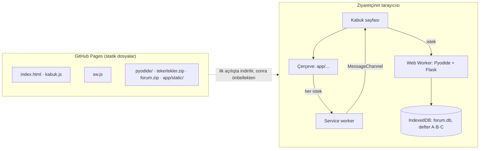

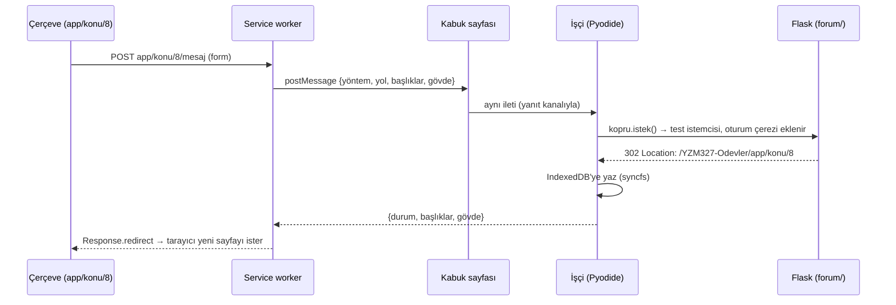

| Karar | Gerekçe |
|---|---|
| Flask'ı tarayıcıda çalıştırmak (statik bir "vitrin" yerine) | Ziyaretçi gerçek uygulamayı kullanır: oy verir, makbuz alır, defteri bozup onarır. Kod tektir; ayrı bir demo yazılmadı |
| Python bir Web Worker'da | WebAssembly'deki Python ana iş parçacığında çalışsa her istekte sayfa donardı |
| İstekler service worker'dan kabuk üzerinden işçiye | Service worker uzun süre canlı tutulamaz (tarayıcı kapatabilir); Python'u barındıran uzun ömürlü kabuk sayfasıdır |
| Pyodide siteyle birlikte sunulur, özetleri doğrulanır | Çalışma anında üçüncü taraf CDN'e bağımlılık ve tedarik zinciri riski olmasın; site bir kez açılınca çevrimdışı çalışsın |
| Tek sekme kilidi (Web Locks) | İki sekme aynı IndexedDB verisinin iki ayrı bellek kopyasına yazıp birbirini ezmesin |
