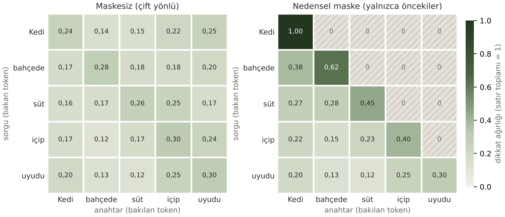

# Mini laboratuvar (S02-50)

*Temel Modelleri Anlamak* sunumunun son slaytındaki "Mini laboratuvar (ödev)" kutusunun dört görevi ve *YZ Mühendisliğine
Giriş* sunumunun son slaytındaki uygulamalı soru 6 (5. bölüm). Her görev tek bir betiktir ve aşağıdaki sayılar o betiklerin
çıktısıdır.

```bash
pip install -r laboratuvar/gereksinimler.txt      # Python 3.12+; forumun kendisi bunlara ihtiyaç duymaz
python laboratuvar/token_orani.py       # 1. görev
python laboratuvar/dikkat.py            # 2. görev (dikkat_isi_haritasi.png üretir)
python laboratuvar/sicaklik.py          # 3. görev, yerel model; API ile: ANTHROPIC_API_KEY=... python laboratuvar/sicaklik.py --api
python laboratuvar/import_dogrula.py --pypi    # 4. görev
python laboratuvar/test_dogrulugu.py    # 5. bölüm (ek kurulum gerekmez)
```

## 1. Türkçe ve İngilizce token sayısı (tiktoken)

Forumdan 10 Türkçe cümle ve İngilizce çevirileri iki kodlayıcıyla (tokenizer) tokenlara ayrıldı. Kodlayıcı dosyaları,
tiktoken'in içinde sabit duran SHA-256 özetleriyle doğrulandı; sonuç resmî dosyalarla birebir aynıdır.

| Kodlayıcı | Ortalama oran (TR / EN) | En düşük – en yüksek | Toplam token TR / EN | Türkçede token başına karakter |
|---|---|---|---|---|
| cl100k_base (GPT-4) | **1,69** | 1,27 – 2,40 | 204 / 124 | 2,4 |
| o200k_base (GPT-4o) | **1,36** | 1,00 – 1,78 | 162 / 122 | 3,1 |

En zor cümle "Öğrenci kulüplerine ayrılan bütçe artırılmalıdır." (cl100k'da 24'e 10 token). Tek bir kelime olan
*Avrupalılaştıramadıklarımızdan* cl100k'da 14, o200k'da 12 tokena bölünüyor: `Av | r | upal | ı | la | şt | ı | ram | ad | ık | larımız | dan`.
Bölünme eklere göre değil, sıklığa göre yapılıyor.

**Yorum (S02-4…6):** Aynı anlam Türkçede eski kodlayıcıyla %69, yenisiyle %36 daha fazla token tutuyor. Yani istek başına
ücret, gecikme ve bağlam penceresine sığan metin aynı oranda Türkçenin aleyhine. Kelime dağarcığı büyüdükçe (100 bin → 200 bin)
fark azalıyor ama kapanmıyor. Agora'nın kural tabanlı denetimi bu yüzden Türkçe ekleri kendisi ele alıyor (ünsüz yumuşaması,
İ/I; `docs/analiz.md` 6.4).

## 2. NumPy ile 5 tokenlık dikkat ve nedensel maske

Slayttaki `dikkat(Q, K, V)` fonksiyonu değiştirilmeden bir `nedensel` seçeneği aldı: softmax'tan önce köşegenin üstündeki
puanlar −∞ yapılıyor. Betik önce slaytın "Kedi süt içti" örneğini yeniden üretiyor (ağırlıklar 0,506 / 0,186 / 0,307,
çıktı [0,66; 0,34]) ve böylece genişletmenin aynı hesabı yaptığını kanıtlıyor. Sonra *Kedi bahçede süt içip uyudu*
cümlesinde öz-dikkat (Q = K) hesaplanıyor. Vektörler öğretim amaçlı seçildi.



- Maskeli matriste köşegenin üstü tam 0 ve her satırın toplamı 1 (betik bunu `assert` ile denetliyor).
- İlk token yalnızca kendisini görebildiği için ağırlığı 1,00. Son token ("uyudu") her şeyi gördüğü için maskeli ve
  maskesiz satırları aynı.
- "içip" en çok kendisine (0,40), sonra "süt"e (0,23) ve "Kedi"ye (0,22) bakıyor: "kim içti, ne içti?" bilgisi temsile karışıyor.
- Maskesiz matristeki dağılım daha düz; d = 4 küçük olduğu için puan farkları da küçük.

## 3. Sıcaklık: aynı istem 10'ar kez

**API ile (betik hazır, bu ortamda çalıştırılamadı).** `sicaklik.py --api` aynı istemi T = 0, 0,7 ve 1,5 ile 10'ar kez
gönderir ve farklı yanıtları sayar. Bu ortamda API anahtarı olmadığı için gerçek sonuç yok; öğrencinin kendi
anahtarıyla çalıştırması gerekir (anahtar koda yazılmaz, ortam değişkeninden okunur, S01-17). Betiği yazarken slayttan sonra
değişmiş üç durum belgelendi:

1. Güncel Claude modelleri (Opus 4.7 ve sonrası) sıcaklık taşıyan isteği **400 hatasıyla reddeder**; Sonnet 5/5.5 ve
   Haiku 5.5 varsayılan dışı değeri reddeder. Deney bu yüzden sıcaklığı hâlâ kabul eden `claude-sonnet-4-6` ile yapılır.
   S02-42'deki "temperature=0 ile sabitle" önlemi yeni modellerde artık uygulanamıyor.
2. Python SDK'sının 1.x sürümü `temperature` parametresini kaldırdı; değer `extra_body` ile gönderiliyor.
3. Anthropic API'sinde sıcaklık 0 ile 1 arasında; T = 1,5 isteği reddedilir. Betik bu reddi de sonuç olarak yazar.

İstek ve hata işleme yolu, yerel bir sahte sunucuya karşı sınandı. Bu yalnızca kodun çalıştığını gösterir, bir ölçüm değildir.

**Yerel deney (çalıştırıldı).** Mekanizmayı göstermek için projenin kılavuzundan (`docs/rehber.md`) bir kelime ikilisi
(bigram) modeli kuruldu. Logit = log(sayım), olasılık = softmax(logit / T). "konu" kelimesinden başlayarak en fazla 6 kelime üretildi:

| T | 10 denemede farklı yanıt | "konu"dan sonra en olası kelimenin olasılığı |
|---|---|---|
| 0 | **1** (hep "konu kaldırma uzmanlık ve API") | 1,00 |
| 0,7 | **9** | 0,11 |
| 1,5 | **10** | 0,05 |

T = 0 açgözlü seçimdir; her çalıştırmada aynı yanıt gelir. (Sayılar kılavuzun güncel metnine bağlıdır; metin değiştikçe
T = 0,7 satırı 9 ile 10 arasında oynayabilir.) T büyüdükçe dağılım düzleşir: en olası kelimenin payı 0,11'den
0,05'e iner ve her deneme başka bir yol izler. Bu yerel model gerçek bir dil modeli değildir; yalnızca sıcaklığın etkisini
gösterir.

## 4. YZ kodlama aracının önerdiği import'lar gerçek mi?

Bir YZ kodlama ajanından 5 fonksiyon istendi. İstemde paket kurmaması, internette aramaması ve kodu çalıştırmaması
söylendi, yani ilk öneri alındı. Öneri değiştirilmeden `yz_onerisi.py` dosyasına kaydedildi. Fonksiyonlar: Türkçe kök bulma,
PDF tablosu okuma, Türkçe tarih ayrıştırma, IBAN denetimi ve Türkçe duygu sınıflandırma. `import_dogrula.py` her import'u
üç düzeyde denetler: paket PyPI'da var mı, modül hangi dağıtımdan geliyor, kullanılan adlar gerçekten var mı.

| Fonksiyon | Önerilen paket (PyPI) | Import ve adlar | Örnek girdiyle çalıştı mı |
|---|---|---|---|
| `kokleri_bul` | zeyrek 0.1.3 (son sürüm Aralık 2022) | ✓ `zeyrek.MorphAnalyzer` | Ancak NLTK'nin `punkt_tab` verisi ayrıca indirilince. Öneri bu adımı söylemiyor. Kök değil sözlük biçimi döndürüyor (okudum → *okumak*) ve ekrana ayrıntı günlüğü basıyor |
| `pdf_tablolari` | pdfplumber 0.11.10, pandas 3.0.6 | ✓ | ✓ (bu raporun PDF'inde sayfa düzenini de tablo saydı) |
| `turkce_tarih` | dateparser 1.4.3 | ✓ `dateparser.parse` | ✓ "3 Ekim 2026 Cumartesi" → 03.10.2026; "dün akşam 8" → önceki gün 20.00 |
| `iban_bilgisi` | schwifty 2026.7.3 | ✓ `IBAN` | ✓ Sağlama hatasını yakaladı, Garanti kodlu örnekte bankayı buldu. Elle yazılmış banka listesi gereksiz, schwifty'de zaten var |
| `duygu` | transformers 5.19.0, torch 2.14.1 | ✓ `pipeline` | Denenemedi. torch birkaç GB, model Hugging Face'ten indirilmeli (bu ortamda ağ kapalı). Önerilen model adının varlığı doğrulanamadı |

**Sonuç:** 7 paket ve 8 import'un hepsi gerçek; uydurma paket adı yok. Ama import düzeyindeki doğrulama yetmiyor. İki
gizli gereksinim (NLTK verisi; torch ve model indirme), bir anlam kayması (kök yerine sözlük biçimi) ve bir bakım riski
(zeyrek 2022'den beri güncellenmemiş) ancak kodu örnek girdiyle çalıştırınca görüldü. S02-46'daki "üretilen kodu
doğrulayın" uyarısı import'larla sınırlı değil, davranışı da kapsıyor. Sıra da önemli: önce `--pypi` ile paket adlarını
denetleyin, tanımadığınız paketi ancak ondan sonra ayrı bir sanal ortama kurun.

## 5. (S01-49, soru 6) YZ'nin yazdığı testlerin kaçı gerçekten doğru?

S01'in son slaytındaki uygulamalı soru: bir kodlama aracına küçük bir fonksiyon ve testlerini yazdırıp testleri denetlemek.
Bir kodlama ajanından T.C. kimlik numarası denetimi ve en az 12 test istendi. Ajandan kodu ve testleri çalıştırmaması,
hesaplarını bir araçla doğrulamaması istendi. Öneri değiştirilmeden `yz_testleri/` klasörüne kaydedildi.
`python laboratuvar/test_dogrulugu.py` iki şeyi ayrı ölçer:

1. **Doğruluk:** Her testin beklediği sonuç, YZ'nin kendi koduyla değil, forumun ayrıca testli `denetim.tc_kimlik_gecerli_mi`
   işleviyle (kâhin, *oracle*) karşılaştırıldı. Testin YZ'nin koduyla geçmesi doğruluk kanıtı değildir; kod ve test aynı
   yanlışı paylaşabilir.
2. **Güç:** YZ'nin fonksiyonuna tek tek 10 gerçekçi hata (mutant) sokuldu. Bir mutantı en az bir test kırmızıya çeviriyorsa
   test o hatayı "yakalamış" sayılır (mutasyon testi).

| Ölçüt | Sonuç |
|---|---|
| Test sayısı | 16 |
| YZ'nin kendi koduyla geçen | 16 |
| Beklentisi tanıma göre doğru olan | **16** (örnek numaraların sağlaması da doğru) |
| Yakalanan mutant | **9 / 10** |
| Hiçbir mutantı yakalamayan test | 7 (ör. boş dize, harf içeren, iç boşluk: aynı kontrolü sınayan tekrarlar) |

**Yakalanamayan hata:** "10. hane denetimi yok" mutantı bütün testlerden geçti. `test_10_hane_sagLama_hatali` testi
`10000000156` numarasını kullanıyor; 10. haneyi değiştirirken 11. hanenin sağlamasını da bozuyor, yani aslında 11. hane
kuralını sınıyor. Kodun 10. hane kuralını silen biri, testlerin hepsini yeşil görür. Doğru test, yalnızca 10. haneyi bozan
`10000000157` olurdu (11. hane yeni ilk 10 haneyle tutarlı): bu numara mutantta geçerli, doğru kodda geçersiz çıkıyor.

**Yanıt:** 16 testin 16'sı doğru, ama "doğru" ile "işe yarar" aynı şey değil. Testlerden biri adının söylediği kuralı
sınamıyor ve 7'si birbirinin tekrarı. Bu yüzden S01-46'nın uyarısı ("testleri de YZ yazdıysa testleri de doğrulayın") yalnızca
beklenen değerlere bakmakla değil, testin hatayı yakalayıp yakalamadığına bakmakla karşılanır. Agora'nın düzeltme testleri
için de aynı ölçüt kullanıldı: her test düzeltmeden önceki kodda kırmızı olmalıydı (README, YZ kullanım beyanı).
